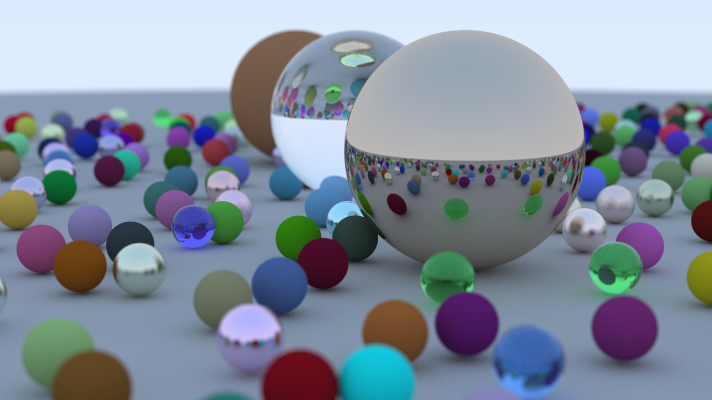

# Ray Tracing in One Weekend

## Overview
My implementation of a simple CPU ray tracer built by following the book: [_Ray Tracing in One Weekend_](https://raytracing.github.io/books/RayTracingInOneWeekend.html).

## Acknowledgments

 - Peter Shirley, Trevor David Black, Steve Hollasch. Authors of the book: [_Ray Tracing in One Weekend_](https://raytracing.github.io/books/RayTracingInOneWeekend.html)
 - Sean Barrett. Creator of [_stb_](https://github.com/nothings/stb), which I am using to output PNG files
